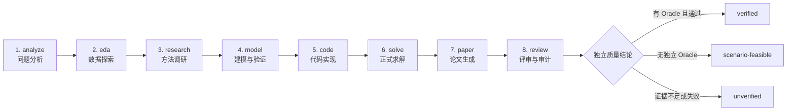

<div align="center">

# MMW · Mathematical Modeling Workflow

**面向全国大学生数学建模竞赛（CUMCM）的 8 阶段、多 Agent、人工审批式工作流**

[](https://github.com/liwenzhonhg-arch/Mathematical_Modeling_Workflow/actions/workflows/tests.yml)
[](https://github.com/liwenzhonhg-arch/Mathematical_Modeling_Workflow/releases/latest)
[](https://www.python.org/)
[](https://github.com/liwenzhonhg-arch/Mathematical_Modeling_Workflow/releases)
[](LICENSE)

[快速开始](#快速开始) · [工作流](#8-阶段工作流) · [质量与可信度](#质量与可信度) · [本地 GUI](#本地-gui-审查台) · [参与贡献](#参与贡献)

</div>

MMW 把一道数学建模题组织为可审查、可回退、可复现的工程流程。AI 负责生成候选方案，人负责审批关键决策，程序负责检查状态、产物、数值出处和独立 benchmark。

> MMW 不是“一键生成正确答案”的工具。8 个阶段全部完成，只表示流程跑完；结果是否可信仍由独立验证决定。

## 核心能力

| 能力 | 说明 |
| --- | --- |
| 8 阶段协作 | 从题目分析、EDA、调研、建模和编码，一直到求解、论文与终审 |
| 人工检查点 | 每个阶段保留版本、审批理由、重做记录和激活版本 |
| 双模型验证 | Modeler 负责建模，Verifier 独立检查假设、公式与可行性 |
| 机器质量门禁 | 检查结构化结果、有限数值、硬约束、交付物和上游版本一致性 |
| 独立 benchmark | evaluator-only 参考契约不进入 Agent 提示词，避免答案泄漏 |
| 数值出处审计 | 追踪论文关键数值与 `results.json`、`sensitivity.json` 等结果文件 |
| 中文 LaTeX 论文 | 分节生成论文、迭代优化摘要，并支持 XeLaTeX 编译与最终导出 |
| CLI + 本地 GUI | 既可使用命令行，也可通过仅监听 `127.0.0.1` 的审查台操作 |
| BYOK + Codex CLI | 默认使用 OpenAI-compatible API，也可调用用户本机已有的 Codex CLI |

## 8 阶段工作流



每个阶段遵循 `pending → completed → approved`。只有审批并激活的版本才会被下游消费；分支方案在审批前不会污染正式流程。

## 快速开始

### 方式一：Windows 便携版

1. 打开 [GitHub Releases](https://github.com/liwenzhonhg-arch/Mathematical_Modeling_Workflow/releases/latest)。
2. 下载 `MMW-Windows-x64-v<版本>.zip` 并完整解压。
3. 双击 `MMW.exe`。
4. 选择包含题目 `.pdf` 或 `.docx` 的文件夹，然后在 GUI 中配置模型并启动。

便携包不包含 API Key、Codex 登录态或 LaTeX。生成最终 PDF 仍需另行安装 MiKTeX 或 TeX Live。旧版 `.doc` 请先用 Word 另存为 `.docx`。

### 方式二：从源码运行

```powershell
git clone https://github.com/liwenzhonhg-arch/Mathematical_Modeling_Workflow.git
Set-Location Mathematical_Modeling_Workflow
python -m pip install -e ".[dev]"
Copy-Item .env.example .env
python -m mmw.cli check-config
python -m mmw.cli gui
```

要求 Python 3.11+。论文编译另需 `xelatex` 与 `bibtex`。

## 模型配置

MMW 提供两种后端，但共用同一套流水线、检查点和质量门禁：

### API / BYOK（默认）

在本机 `.env` 中配置：

```dotenv
LLM_BACKEND=openai
LLM_API_KEY=your-api-key
LLM_BASE_URL=https://your-provider.example/v1
LLM_MODEL=your-model
```

接口需要兼容 OpenAI Chat Completions。`MODELER_*`、`VERIFIER_*`、`WRITER_*` 和 `CODER_*` 可分别覆盖默认配置。

### 本机 Codex CLI（可选）

```powershell
codex login
codex login status
```

然后把 `.env` 中的 `LLM_BACKEND` 设为 `codex`。MMW 只调用用户本机已有的 `codex` / `codex.cmd` 并复用其登录状态，不读取或上传 Codex 会话凭据；Codex 不存在或未登录时会明确失败，不会静默切换到 API。

## CLI 常用命令

```powershell
python -m mmw.cli init 2026_cumcm_A --problem A --year 2026
python -m mmw.cli run next --workspace 2026_cumcm_A
python -m mmw.cli approve analyze --workspace 2026_cumcm_A
python -m mmw.cli status --workspace 2026_cumcm_A
python -m mmw.cli audit --workspace 2026_cumcm_A
python -m mmw.cli benchmark --case 2020A_炉温曲线 --workspace 2026_cumcm_A --stage solve
python -m mmw.cli compile --workspace 2026_cumcm_A
python -m mmw.cli export --workspace 2026_cumcm_A
```

完整命令还包括 `show`、`branch`、`compare`、`ack`、`rework`、`diff` 和 `log`。使用 `python -m mmw.cli --help` 查看入口帮助。

## 本地 GUI 审查台

```powershell
python -m mmw.cli gui
```

浏览器审查台运行在 `http://127.0.0.1:8765/`，按以下结构组织操作：

- **流程总览**：查看 8 个阶段、当前任务、耗时和最终失败原因。
- **阶段审查**：阅读产物、填写审批或重做理由、选择是否立即重跑。
- **质量与验证**：执行数值审计、benchmark、论文编译和最终导出。
- **版本与方案**：比较检查点版本、切换已审批方案、处理上游变化。
- **论文与交付**：检查最终可信等级及成果文件。

GUI 可选择本机任意题目文件夹。扫描阶段保持只读；用户点击启动后才会创建：

```text
题目文件夹/
├─ 原始题目.pdf / 原始题目.docx   # 保持原位，不改名、不覆盖
├─ 附件与数据                     # 保持原位
├─ .mmw/                          # 检查点、日志、缓存与决策记录
└─ output/                        # 论文、benchmark 与最终交付物
```

## 质量与可信度

| 等级 | 含义 |
| --- | --- |
| `verified` | 存在独立隐藏 Oracle 或参考契约，并且全部检查通过 |
| `scenario-feasible` | 通过约束、仿真或压力测试，但没有独立现实 Oracle |
| `unverified` | 只有 Agent 推理，或关键证据缺失、过期、失败 |

- `audit` 是纯本地、确定性的论文数值出处审计，不调用 LLM。
- `benchmark` 在正常流水线结束后独立运行；参考范围不会进入 Agent 提示词或普通检查点。
- `review` 的 benchmark 必须绑定当前 `solve` / `review` 版本，报告缺失、失败或过期时不能审批。
- 真题实测与可公开的交付快照保存在 [`test_cases/`](test_cases/)。

## 项目结构

```text
mmw/
├─ agents/       # 多 Agent 角色
├─ pipeline/     # 8 阶段调度与状态机
├─ prompts/      # 中文 Jinja2 提示词
├─ utils/        # 检查点、执行器、审计等通用能力
├─ latex/        # 论文组装与编译
└─ gui/          # 本地 GUI 服务与无构建静态前端
knowledge/       # HMML 方法知识库
test_cases/      # 真题实测、缺陷记录与独立 benchmark
tests/           # 自动化测试
```

## 开发与验证

```powershell
pytest -q
python -m compileall -q mmw
git diff --check
```

详细规范见 [`AGENTS.md`](AGENTS.md)，贡献流程见 [`CONTRIBUTING.md`](CONTRIBUTING.md)。

## 安全边界

生成代码会经过网络、子进程和动态执行检查，并移除子进程环境中的密钥变量，但这不是操作系统级容器。只在隔离账户或虚拟机中处理不可信题目附件和参考资料。

GUI 只监听本机回环地址；浏览器不持久化 API Key，也不能提交任意绝对路径。Windows 更新器校验 Release SHA256、下载与解压体积，并拒绝路径穿越。

安全问题的提交方式与范围见 [`SECURITY.md`](SECURITY.md)。

## 参与贡献

欢迎提交可复现的缺陷、质量门禁改进、通用建模方法和小范围 Pull Request。请先阅读 [`CONTRIBUTING.md`](CONTRIBUTING.md)，不要在 Issue、日志、测试快照或提交中包含 API Key、token、竞赛隐私数据和本机 Codex 会话文件。

## 许可证

本项目采用 [MIT License](LICENSE)。
